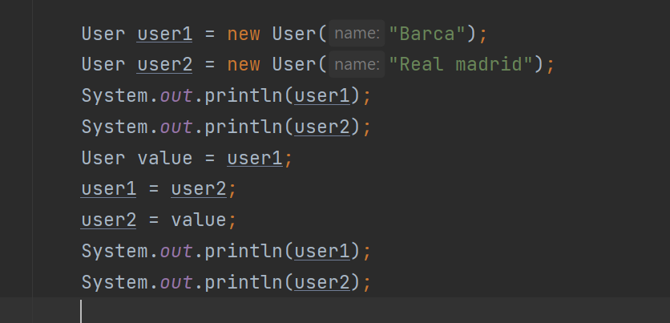
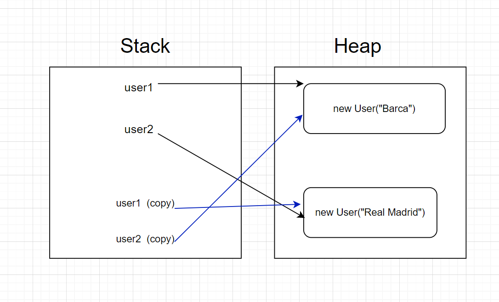
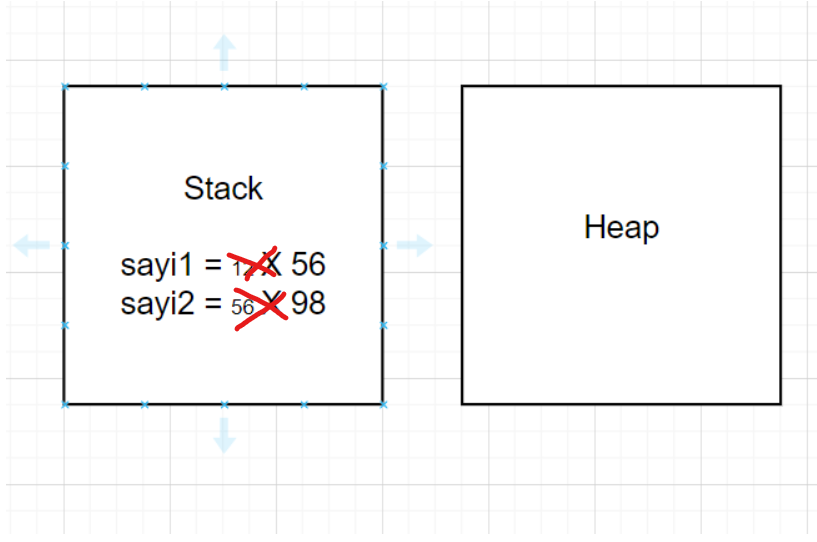
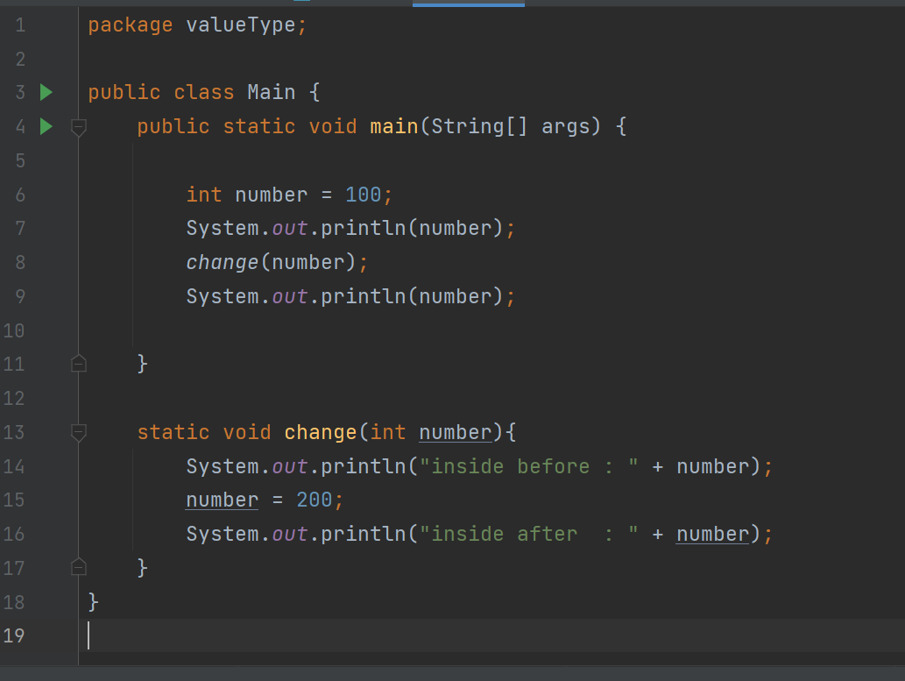
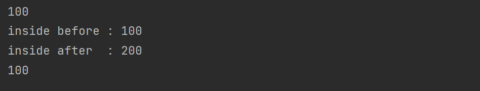
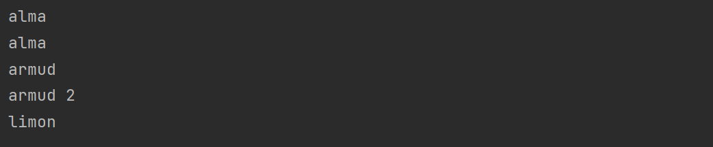

# Stack Memory And Heap Space

Java-da yaddaşın idarə edilməsi mühüm prosesdir. Java tərəfindən avtomatik idarə olunur. JVM yaddaşı iki hissəyə bölür: Stack yaddaşı və Heap yaddaş. Java baxımından hər ikisi vacib yaddaş sahələridir, lakin hər ikisi fərqli məqsədlər üçün istifadə olunur. Stack yaddaşı ilə Heap yaddaşı arasındakı əsas fərq ondan ibarətdir ki, Stack yaddaşı obyektləri saxlayır və dinamik yaddaşın ayrılması və boşaldılmasından istifadə edərkən, Heap metodun icrası qaydasını və local dəyişənləri saxlamaq üçün istifadə olunur.

# Stack nədir ?

Stack yaddaşı, işləmə zamanı hər bir thread üçün ayrılmış fiziki bir yerdir (RAM-da). Bir thread yarandıqda eyni zamanda stack də yaradılır. Stack-də yaddaşın idarə edilməsi LIFO  prinsipinə uyğundur . O, dəyişənləri(int , long , boolean , char , byte , double , float) , method-ları və obyekt reference-larını saxlayır. Stack üçün ayrılmış yaddaş funksiya geri qayıdana qədər yaşayır. Yəni obyektlərin yaradılması üçün yer yoxdursa, o, java.lang.StackOverFlowError-u atır.  JVM hər thread üçün ayrıca stack yaradır.

Note : Statik dəyişənin yaddaşı proqramın başlanğıcında stack əvəzinə adi yaddaşda (proqram üçün xüsusi olaraq ayrılmış yaddaş) ayrılır. Bunun üstünlüyü ondan ibarətdir ki, dəyişən və ya prosedurunuzu tamamilə sabit edir və siz təsadüfən dəyəri dəyişə bilməzsiniz.

# Heap nədir ?

JVM işə salındıqda yaradılır və proqram işlədiyi müddətdə tətbiq tərəfindən istifadə olunur. Obyektləri və JRE siniflərini saxlayır. Hər dəfə biz obyektlər yaratsaq, o, Heap yaddaşında yer tutur, həmin obyektin reference-ı isə stack-də yaradır. O, stack kimi heç bir sıraya əməl etmir. O, yaddaş bloklarını dinamik şəkildə idarə edir. Bu o deməkdir ki, yaddaşı əl ilə idarə etmək lazım deyil. Yaddaşı avtomatik idarə etmək üçün Java artıq istifadə olunmayan obyektləri silən Garbage Collector-u təmin edir. Heap üçün ayrılmış yaddaş hər hansı bir hadisəyə, ya proqram dayandırılana, ya da yaddaş boş qalana qədər yaşayır. Bu, bütün thread-lərlə paylaşılan ümumi yaddaş sahəsidir. Heap sahəsi doludursa, java.lang.OutOfMemoryError-u atır.

# Data Types

Bu dəyişən tiplərinin stack/heap yerləşmələri tamamilə fərqlidir :

+ Primitive type-lar yəni dəyər tiplər yalnız RAM-ın Stack hissəsində tutulur .
+ Reference type-ların isə stack hissəsində reference-ı heap hissəsində isə obyekti yaranır (aşağıda nümunə və sxemlər ilə ətraflı izah olunub)

Primitive types :
+ Nümunə 1 :

OUTPUT : 56

Şəkildən göründüyü kimi burada sayi1-in qiyməti sayi2-in qiymətinə bərabərdir .
Dəyərlərin dəyişdirilməsi aparılır ancaq bağlantı qalmır . 

+ Nümunə 2 :

Göründüyü kimi burada method-a dəyərimizin adresini(reference-nı) yox dəyərimizin kopyasını göndərdik . Dəyişiklikdə yalnız kopya üzərində baş verir və  main-in içindəki number eyni qalır . 
Bu qayda digər primitive type-lar(byte , short , long , char , boolean , float , double) üçündə eynidir yəni RAM-da yalnız stack hissəsində var olurlar .

Data type-ların yaddaşda tutduğu yer : 

Note : String Value type (Primitive type) deyil ! String char array-indən ibarət olduğundan yaddaşda simvollarının sayının 2 misli qədər yer tutur .
